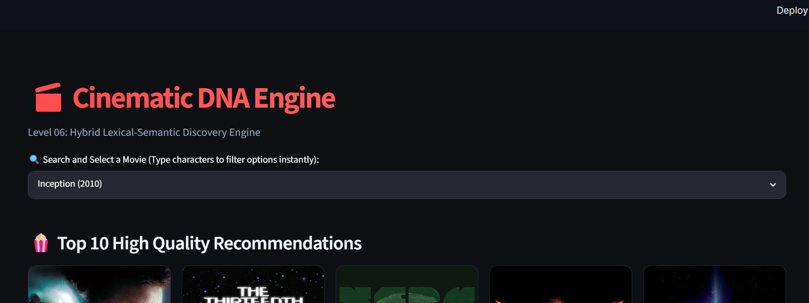
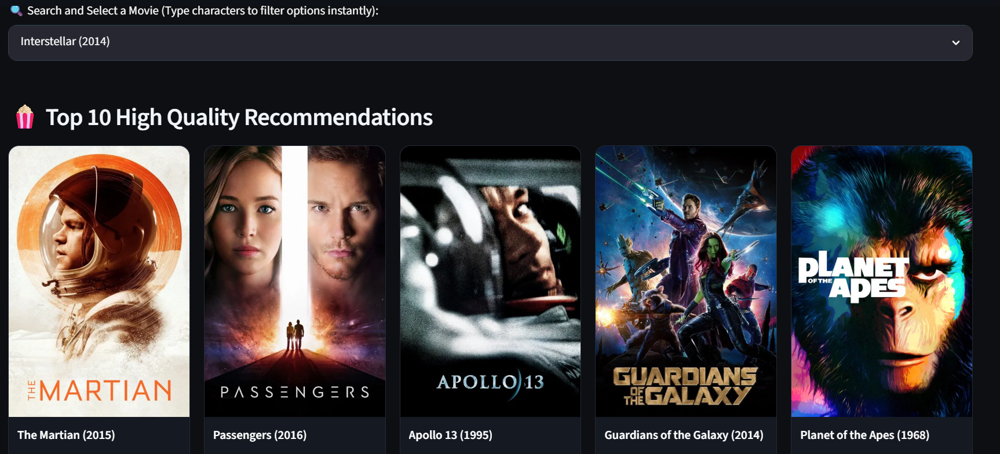
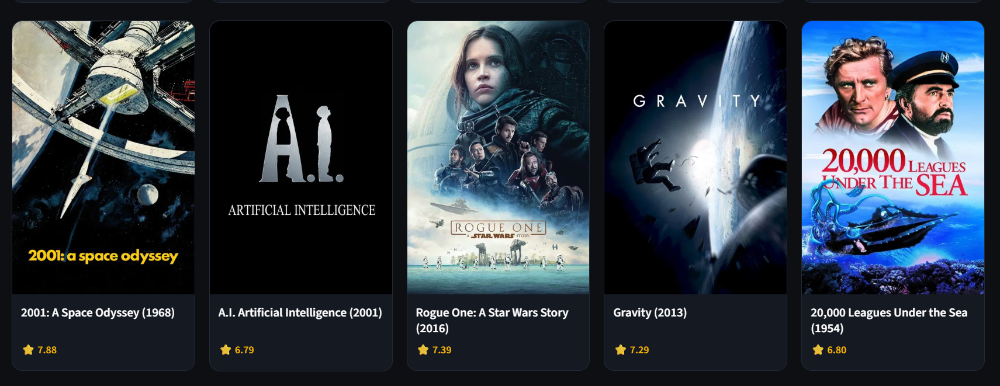
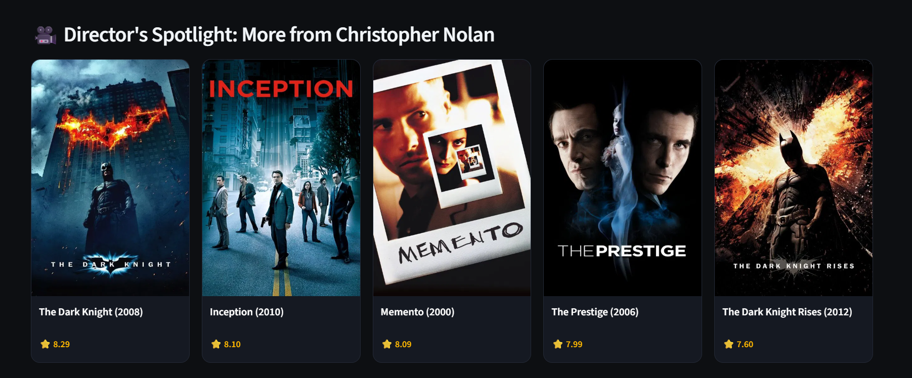

# 🎬 Cinematic DNA Engine

> **A Hybrid Lexical-Semantic Movie Recommendation System powered by Sentence Transformers, Bayesian Ranking, and Streamlit.**

Cinematic DNA Engine is an intelligent content-based movie recommendation system that goes beyond traditional genre matching. By combining lexical features with semantic embeddings, it recommends films based on narrative structure, themes, tone, and overall cinematic similarity rather than simple keyword overlap.

The project is designed to help users discover movies that "feel" similar, even when they belong to different genres or franchises.

---

## 🌟 Features

- 🔍 **Hybrid Recommendation Engine**
  - Combines lexical similarity with semantic embeddings for more meaningful recommendations.

- 🧠 **Sentence Transformers**
  - Uses transformer-based embeddings to understand the semantic meaning of movie metadata.

- ⭐ **Bayesian Rating**
  - Displays Bayesian-weighted ratings to reduce bias toward movies with very few ratings.

- 🎬 **Director Spotlight**
  - Highlights additional works by the selected movie's director for deeper exploration.

- 🖼️ **TMDB Poster Integration**
  - Fetches high-quality movie posters using the TMDB API.

- ⚡ **Instant Search**
  - Fast movie lookup with autocomplete.

- 🎨 **Modern Streamlit UI**
  - Responsive dark-themed interface built using Streamlit and custom CSS.

---

# 🏗 System Architecture

```
                     User
                       │
                       ▼
                Movie Selection
                       │
                       ▼
             Metadata Processing
                       │
        ┌──────────────┴──────────────┐
        ▼                             ▼
 Lexical Representation      Sentence Transformer
      (TF-IDF)                  Embeddings
        │                             │
        └──────────────┬──────────────┘
                       ▼
             Hybrid Similarity Engine
                       │
                       ▼
              Bayesian Score Ranking
                       │
                       ▼
             Top 10 Recommendations
                       │
        ┌──────────────┴──────────────┐
        ▼                             ▼
   Movie Posters             Director Spotlight
```

---

# 🚀 Tech Stack

| Category | Technologies |
|----------|--------------|
| Language | Python |
| Data Processing | Pandas, NumPy |
| Machine Learning | Scikit-learn |
| NLP | Sentence Transformers |
| Similarity Search | Cosine Similarity |
| Frontend | Streamlit |
| Styling | HTML + CSS |
| API | TMDB API |
| Serialization | Pickle |

---

# 📂 Dataset

- MovieLens Latest Full Dataset
- TMDB API (Movie Posters)

The dataset contains thousands of movies with metadata including genres, tags, ratings, and release information.

---

# ⚙ Recommendation Pipeline

### 1. Metadata Preparation

Movie genres and user tags are cleaned and merged into a unified textual representation.

---

### 2. Semantic Encoding

Each movie is converted into a dense semantic embedding using a Sentence Transformer model.

---

### 3. Lexical Similarity

Traditional lexical similarity is computed using TF-IDF features.

---

### 4. Hybrid Retrieval

The lexical and semantic similarity scores are combined to create a balanced recommendation score capable of retrieving both closely related and semantically meaningful movies.

---

### 5. Bayesian Ranking

Recommendations are further refined using Bayesian weighted ratings to improve recommendation quality.

---

### 6. Presentation Layer

The application displays:

- Movie posters
- Bayesian ratings
- Director Spotlight
- Interactive recommendation cards

---

# 🧪 Evaluation

Instead of relying solely on numerical metrics, the recommendation engine was qualitatively evaluated across a diverse collection of films representing different genres, storytelling styles, and cinematic themes.

### Evaluation Movies

- Interstellar
- The Godfather
- No Country for Old Men
- Eternal Sunshine of the Spotless Mind
- Incendies
- There Will Be Blood
- Raging Bull
- The Lord of the Rings
- Harry Potter
- Inception

The hybrid recommendation engine consistently produced semantically meaningful recommendations across science fiction, crime, fantasy, psychological drama, romance, and auteur cinema.

---

# 📸 Screenshots

## Home Page

<p align="center">
  
</p>


---

## Recommendations

<p align="center">
  
</p>
<p align="center">
  
</p>

---

## Director Spotlight

<p align="center">
  
</p>

---

# 📦 Installation

Clone the repository

```bash
git clone https://github.com/varun858-tech/cinematic-dna-engine.git
```

Move into the project directory

```bash
cd cinematic-dna-engine
```

Install dependencies

```bash
pip install -r requirements.txt
```

Create a `.env` file

```env
TMDB_API_KEY=YOUR_API_KEY
```

Run the application

```bash
streamlit run app.py
```

---

# 🎯 Future Improvements

- Explainable AI recommendations
- Collaborative filtering
- User personalization
- Vector databases (FAISS / ChromaDB)
- Conversational movie assistant using LLMs
- User watch history
- Mood-based recommendations

---

# 💡 Key Learnings

This project helped me explore:

- Content-Based Recommendation Systems
- Sentence Transformers
- Semantic Search
- Hybrid Retrieval Systems
- Recommendation Ranking
- Streamlit Application Development
- API Integration
- End-to-End Machine Learning Deployment

---

# 👨‍💻 Author

**Varun Bahuguna**

Computer Science Engineering Student

Passionate about Machine Learning, Recommendation Systems, NLP, and Generative AI.

---

## ⭐ If you found this project interesting, consider giving it a star!